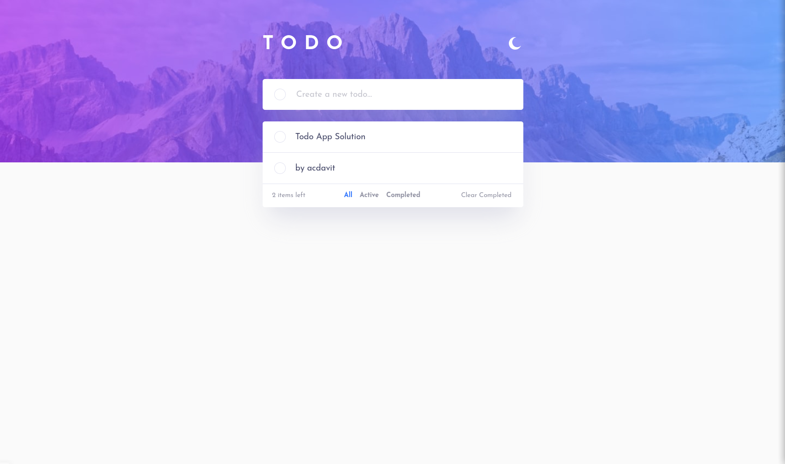

# Bitoid - Todo app solution

This is a solution to the Todo app challenge on Bitoid 

## Table of contents

- [Overview](#overview)
  - [The challenge](#the-challenge)
  - [Screenshot](#screenshot)
  - [Links](#links)
  - [Built with](#built-with)
  - [Useful resources](#useful-resources)
- [Author](#author)
- [Acknowledgments](#acknowledgments)

## Overview

### The challenge

Users should be able to:

- View the optimal layout for the app depending on their device's screen size
- See hover states for all interactive elements on the page
- Add new todos to the list
- Mark todos as complete
- Delete todos from the list
- Filter by all/active/complete todos
- Clear all completed todos
- Toggle light and dark mode
- **Bonus**: Drag and drop to reorder items on the list

### Screenshot

### Links

- Solution URL: [Add solution URL here](https://github.com/acdavit/todo-app)
- Live Site URL: [Add live site URL here](https://todo-app-acdavit.netlify.app/)

## My process

### Built with

- Semantic HTML5 markup
- CSS custom properties
- Flexbox
- CSS Grid
- Mobile-first workflow
- [React](https://reactjs.org/) - JS library
- [Next.js](https://nextjs.org/) - React framework
- [DND Kit](https://dndkit.com/) - For drag and drop functionality

### Useful resources

- [React DND Tutorial - Cooper Codes](https://www.youtube.com/watch?v=Z8RoA_YSGDQ&t=81s&ab_channel=CooperCodes) - This video helped me in implementing the Drag and Drop functionality in this app

## Author

- LinkedIn - [David Abakelia-Chartia](https://www.linkedin.com/in/%E1%83%93%E1%83%90%E1%83%95%E1%83%98%E1%83%97-%E1%83%90%E1%83%91%E1%83%90%E1%83%99%E1%83%94%E1%83%9A%E1%83%98%E1%83%90-%E1%83%A9%E1%83%90%E1%83%A0%E1%83%A2%E1%83%98%E1%83%90-16a85524a/)
- GitHub - [@acdavit](https://github.com/acdavit)

## Acknowledgments

Huge thanks to [Cooper Codes](https://www.youtube.com/@CooperCodes) for a simple explanation on how to implement Drag and Drop functionality in React
